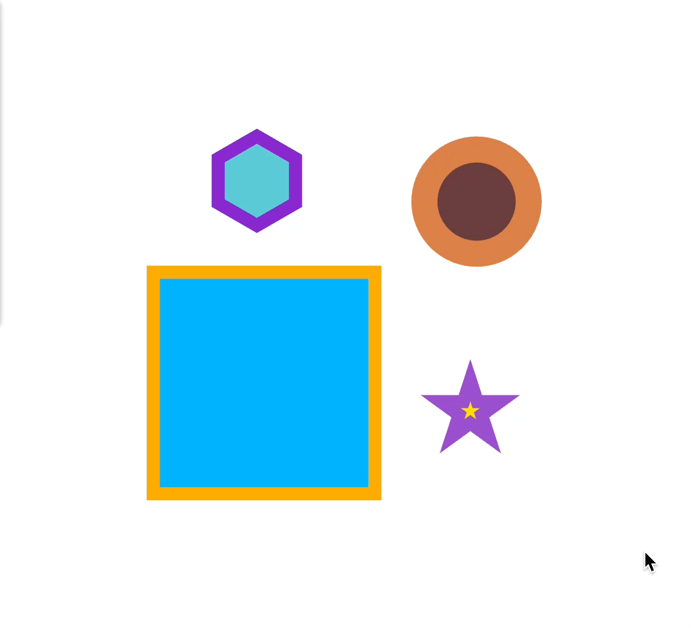
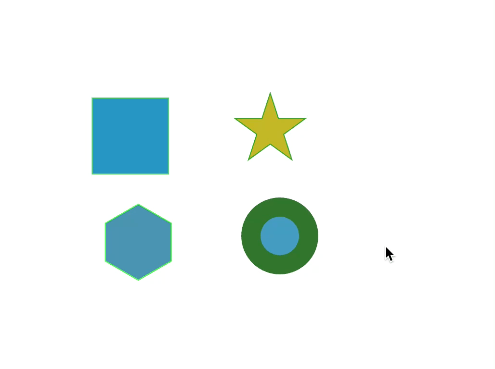

<!--
 * @Author: zi.yang
 * @Date: 2024-02-01 14:42:21
 * @LastEditors: zi.yang
 * @LastEditTime: 2025-04-25 11:27:40
 * @Description: Readme
 * @FilePath: /leafer-x-tooltip/README.en.md
-->
# leafer-x-tooltip

English | [简体中文](./README.md)

[](https://www.npmjs.com/package/leafer-x-tooltip)
[](https://github.com/Alessandro-Pang/leafer-x-tooltip/blob/main/LICENSE)

The Tooltip plugin is primarily used to display custom information on Leafer elements/nodes. When the mouse hovers over or clicks on an element, a popup will appear showing detailed information about the node.

> **Note**: This plugin requires leafer v1.0.0.rc.17 **or above**. Currently, there is no compatibility testing for versions below rc.17.  
> If your project uses leafer v1.0.0.rc.1 **or below**, please use the [leafer-tooltip-plugin](https://github.com/Alessandro-Pang/leafer-tooltip-plugin) instead.

## Online Demo

[Live Demo](https://alexpang.cn/leafer-x-tooltip/)

## Features

- 🚀 Lightweight: Small size, doesn't affect application performance
- 🎨 Highly customizable: Supports custom styles, content, and trigger methods
- 🔍 Flexible filtering: Specify which types of elements display tooltips
- 🎯 Multiple trigger methods: Supports both hover and click triggers
- 📱 Easy to use: Simple API, quick integration into Leafer projects

## Development

**Note:** Please use `npm` as the package manager to install dependencies. When using `pnpm` for development, everything works normally, but packaging will result in errors.

```sh
npm run start # Start the project

npm run build # Build the plugin code, also creates types

npm run test # Run automated tests
```

## Quick Start

### Installation

```shell
npm i leafer-x-tooltip --save
```

### Basic Usage

```javascript
import { Leafer } from 'leafer-ui';
import { TooltipPlugin } from 'leafer-x-tooltip';

// Create a Leafer instance
const leafer = new Leafer({
  container: document.getElementById('container'),
  width: 800,
  height: 600
});

// Add some elements
const rect = leafer.add({
  type: 'Rect',
  x: 100,
  y: 100,
  width: 200,
  height: 100,
  fill: '#42b883'
});

// Initialize the Tooltip plugin
const tooltip = new TooltipPlugin(leafer, {
  // Get display content
  getContent: (node) => {
    return  `<ul style="list-style: none; margin: 0; padding: 0">
      <li>Node type: ${node.tag}</li>
      <li>Width: ${node.width}</li>
      <li>Height: ${node.height}</li>
    </ul>
    `;
  }
});
```

### Demo



## Advanced Usage

### Display Only Specific Element Types

Pass the `includeTypes` parameter to limit which types can display tooltips:

```javascript
import { TooltipPlugin } from 'leafer-x-tooltip';

const plugin = new TooltipPlugin(leafer, {
  includeTypes: ['Ellipse'],
  getContent(node) {
    return `
      <ul style="list-style: none; margin: 0; padding: 0">
        <li>Node type: ${node.tag}</li>
        <li>Width: ${node.width}</li>
        <li>Height: ${node.height}</li>
      </ul>
    `;
  },
});
```

#### Demo



### Exclude Specific Element Types

Pass the `excludeTypes` parameter to exclude types that should not display tooltips:

```javascript
import { TooltipPlugin } from 'leafer-x-tooltip';

const plugin = new TooltipPlugin(leafer, {
  excludeTypes: ['Ellipse'],
  getContent(node) {
    return `
      <ul style="list-style: none; margin: 0; padding: 0">
        <li>Node type: ${node.tag}</li>
        <li>Width: ${node.width}</li>
        <li>Height: ${node.height}</li>
      </ul>
    `;
  },
});
```

#### Demo


### Custom Container Style

Pass the `className` parameter to customize the container style:

```javascript
import { TooltipPlugin } from 'leafer-x-tooltip';

const plugin = new TooltipPlugin(leafer, {
  // Specify a custom class name
  className: 'my-custom-tooltip',
  getContent(node) {
    return `
      <ul style="list-style: none; margin: 0; padding: 0">
        <li>Node type: ${node.tag}</li>
        <li>Width: ${node.width}</li>
        <li>Height: ${node.height}</li>
      </ul>
    `;
  },
});
```

Add custom class styles in your CSS:

```css
.my-custom-tooltip{
  border: 1px solid rgba(0, 157, 255, .62);
  padding: 6px;
  background-color: rgb(131, 207, 255);
  color: #fff;
  font-size: 12px;
  font-weight: 400;
}
```

#### Demo


### Custom Display Conditions

Pass the `shouldBegin` parameter to allow custom restriction methods:

shouldBegin is a function that receives the current event object. You can access the entire event and the node that triggered the event. It should return a Boolean to control whether the tooltip is displayed.

```javascript
import { TooltipPlugin } from 'leafer-x-tooltip';

const plugin = new TooltipPlugin(leafer, {
  shouldBegin: (event) => {
    // Restrict by mouse position, only show tooltip when mouse Y coordinate is greater than 100
    return event.target.y > 100;
  },
  getContent(node) {
    return `
      <ul style="list-style: none; margin: 0; padding: 0">
        <li>Node type: ${node.tag}</li>
        <li>Width: ${node.width}</li>
        <li>Height: ${node.height}</li>
      </ul>
    `;
  },
});
```

#### Demo


### Set Trigger Method

Use the `triggerType` parameter to set the trigger method, supporting both `hover` (default) and `click`:

```javascript
import { TooltipPlugin } from 'leafer-x-tooltip';

const plugin = new TooltipPlugin(leafer, {
  // Set to click trigger
  triggerType: 'click',
  getContent(node) {
    return `
      <ul style="list-style: none; margin: 0; padding: 0">
        <li>Node type: ${node.tag}</li>
        <li>Width: ${node.width}</li>
        <li>Height: ${node.height}</li>
      </ul>
    `;
  },
});
```

### Set Offset

Use the `offset` parameter to set the tooltip's offset relative to the mouse:

```javascript
import { TooltipPlugin } from 'leafer-x-tooltip';

const plugin = new TooltipPlugin(leafer, {
  // Set offset to 10px
  offset: 10,
  // You can also set x and y direction offsets separately
  // offset: [10, 20] or offset: { x: 10, y: 20 }
  getContent(node) {
    return `
      <ul style="list-style: none; margin: 0; padding: 0">
        <li>Node type: ${node.tag}</li>
        <li>Width: ${node.width}</li>
        <li>Height: ${node.height}</li>
      </ul>
    `;
  },
});
```

## API Reference

### Properties

| Property      | Type    | Description                                             | Default |
|--------------|-------|------------------------------------------------|------|
| className    | `string` | Custom container class style, custom styles will override default styles | -    |
| offset    | `number`, `[number, number]`, `{x: number, y: number}` | Offset value                          | 6    |
| includeTypes | `string[]`  | List of types allowed to display tooltips                         | All types |
| excludeTypes | `string[]`  | List of types not allowed to display tooltips                         | None |
| shouldBegin  | `function`  | Custom display control function, takes MouseEvent, requires a Boolean return to control display | All types |
| getContent   | `function`  | Display content, takes node information, requires an HTML string return               | -    |
| triggerType   | `string`  | Event trigger type, supports `hover` and `click`               | `hover`    |

### Methods

| Method Name         | Description                                           | Parameter Type        | Return Type  |
|--------------------|----------------------------------------------|---------------------|--------|
| getDomId           | Returns the tooltip container DOM ID                         | -                   | String |
| createStyleRule    | Creates a CSS class style rule with its own scope to avoid pollution                      | `string`            | -      |
| removeStyleRule    | Removes a CSS class style rule created by `createStyleRule` | `string`            | -      |
| findStyleRuleIndex | Finds a created class style rule, returns the index                            | `string`              | -      |
| addClass           | Adds class styles to the container                                     | `string\|string[]` | -      |
| removeClass        | Removes class styles from the container                                     | `string\|string[]` | -      |
| destroy            | Destroys the plugin                                         | -                   | -      |

## FAQ

### Tooltip not displaying?

1. Check if your Leafer version is v1.0.0.rc.17 or above
2. Confirm that the `getContent` function returns a valid HTML string
3. If you set `includeTypes`, confirm that the target element type is in the list
4. If you set `excludeTypes`, confirm that the target element type is not in the list
5. If you set `shouldBegin`, confirm that the function returns `true`

### How to display complex content in the tooltip?

The `getContent` function can return any valid HTML string, including tables, charts, images, etc.:

```javascript
getContent(node) {
  return `
    <div>
      <h3 style="margin: 0 0 8px 0">${node.tag}</h3>
      <table style="border-collapse: collapse; width: 100%">
        <tr>
          <td style="padding: 4px; border: 1px solid #ddd">Position</td>
          <td style="padding: 4px; border: 1px solid #ddd">(${node.x}, ${node.y})</td>
        </tr>
        <tr>
          <td style="padding: 4px; border: 1px solid #ddd">Size</td>
          <td style="padding: 4px; border: 1px solid #ddd">${node.width} x ${node.height}</td>
        </tr>
      </table>
    </div>
  `;
}
```

## Contributing

Issues and Pull Requests are welcome to help improve this plugin!

## License

[MIT](https://github.com/Alessandro-Pang/leafer-x-tooltip/blob/main/LICENSE)
