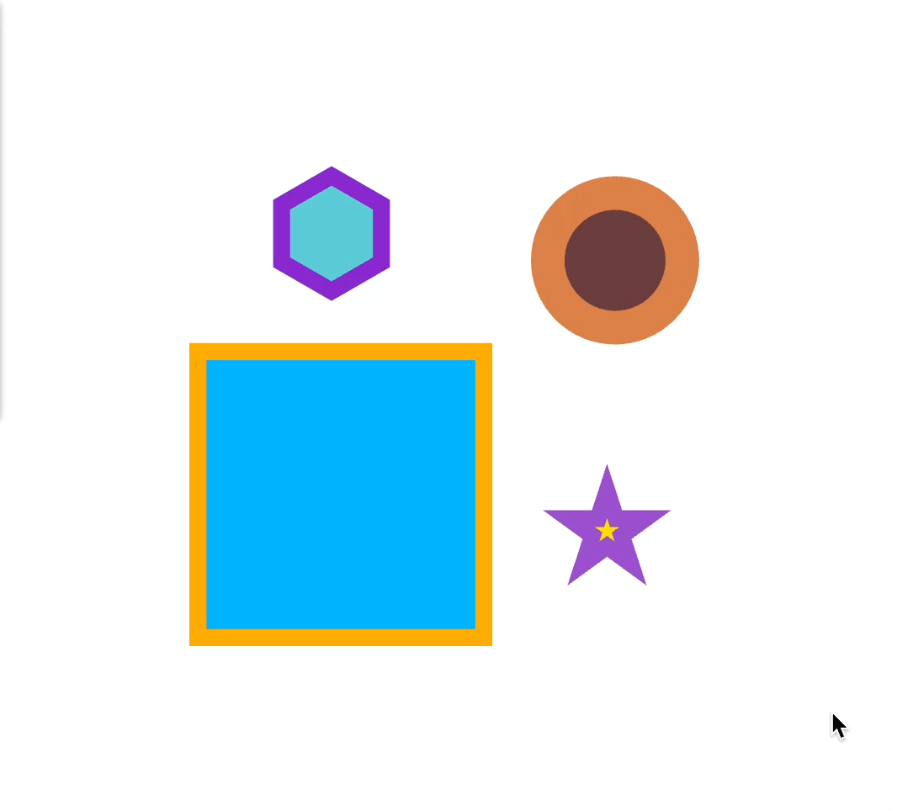
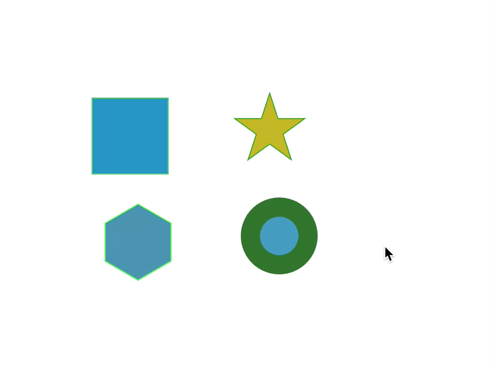
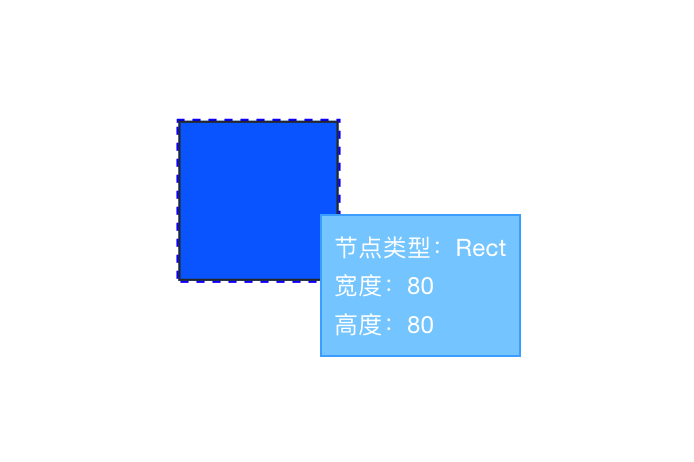
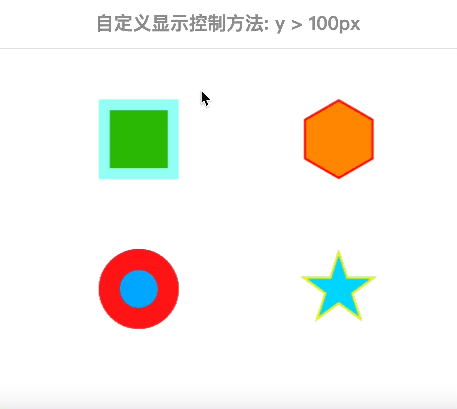

<!--
 * @Author: zi.yang
 * @Date: 2024-02-01 14:42:21
 * @LastEditors: zi.yang
 * @LastEditTime: 2025-04-23 13:57:07
 * @Description: Readme
 * @FilePath: /leafer-x-tooltip/README.md
-->
# leafer-x-tooltip

Tooltip 插件主要用于 Leafer 元素/节点上 展示一些自定义信息。

使用 Tooltip 插件后，当鼠标悬浮在元素上时，会显示一个弹框展示节点的详细信息。

> 注意：该插件依赖 leafer v1.0.0.rc.17 **及以上**版本, 目前没有对 rc.17 以下版本做兼容测试处理  
> 如果你的项目使用的 leafer v1.0.0.rc.1 **以下**版本，请使用 [leafer-tooltip-plugin](https://arc.net/l/quote/fcppgncg) 插件

在线演示地址：<https://alexpang.cn/leafer-x-tooltip/>

## 参与开发

**注意：** 请使用 `npm` 作为包管理器安装依赖，当使用 `pnpm` 安装依赖开发时正常，打包会报错。

```sh
npm run start # 开始运行项目

npm run build # 打包插件代码，同时会创建types

npm run test # 自动化测试
```

# 快速上手

## 安装

```shell
npm i leafer-x-plugin --save
```

## 使用方法

使用插件时，传入 `getContent` 参数，并返回需要展示的内容即可

```js
import { TooltipPlugin } from 'leafer-x-tooltip';
// 需要传入 leafer 实例
const leafer = new Leafer({ view: window })
// 创建插件实例
const plugin = new TooltipPlugin(leafer, {
  getContent(node) {
    const dom = `<ul style="list-style: none; margin: 0; padding: 0">
      <li>节点类型：${node.tag}</li>
      <li>宽度：${node.width}</li>
      <li>高度：${node.height}</li>
    </ul>
    `;
    return dom;
  },
});
```

### 效果演示



## 允许仅显示指定的类型

传入 `includeTypes` 参数，限制允许显示提示框的类型

```js
import { TooltipPlugin } from 'leafer-x-tooltip';
// 需要传入 leafer 实例
const leafer = new Leafer({ view: window })
// 创建插件实例
const plugin = new TooltipPlugin(leafer, {
  includeTypes: ['Ellipse'],
  getContent(node) {
    const dom = `<ul style="list-style: none; margin: 0; padding: 0">
      <li>节点类型：${node.tag}</li>
      <li>宽度：${node.width}</li>
      <li>高度：${node.height}</li>
    </ul>
    `;
    return dom;
  },
});
```

### 效果演示



## 允许仅不显示指定的元素类型

传入 `excludeTypes` 参数，限制允许显示提示框的类型

```js
import { TooltipPlugin } from 'leafer-x-tooltip';
// 需要传入 leafer 实例
const leafer = new Leafer({ view: window })
// 创建插件实例
const plugin = new TooltipPlugin(leafer, {
  exincludeTypes: ['Ellipse'],
  getContent(node) {
    const dom = `<ul style="list-style: none; margin: 0; padding: 0">
      <li>节点类型：${node.tag}</li>
      <li>宽度：${node.width}</li>
      <li>高度：${node.height}</li>
    </ul>
    `;
    return dom;
  },
});
```

### 效果演示


## 允许自定义容器类样式

传入 `className` 参数，自定义容器类样式

```js
import { TooltipPlugin } from 'leafer-x-tooltip';
// 需要传入 leafer 实例
const leafer = new Leafer({ view: window })
// 创建插件实例
const plugin = new TooltipPlugin(leafer, {
  // 指定注册类型
  className: 'my-tooltip-plugin',
  getContent(node) {
    const dom = `<ul style="list-style: none; margin: 0; padding: 0">
      <li>节点类型：${node.tag}</li>
      <li>宽度：${node.width}</li>
      <li>高度：${node.height}</li>
    </ul>
    `;
    return dom;
  },
});
```

css 中添加自定义的类样式

```css
.my-custom-tooltip{
  border: 1px solid rgba(0, 157, 255, .62);
  padding: 6px;
  background-color: rgb(131, 207, 255);
  color: #fff;
  font-size: 12px;
  font-weight: 400;
}
```

### 效果演示



## 允许自定义限制方法

传入 `shouldBegin` 参数，允许自定义限制方法。

`shouldBegin` 为一个函数，传入 `MouseEvent`, 你可以拿到整个事件和触发事件的`node`,要求返回一个 `Boolean` 控制是否显示

```js
import { TooltipPlugin } from 'leafer-x-tooltip';
// 需要传入 leafer 实例
const leafer = new Leafer({ view: window })
// 创建插件实例
const plugin = new TooltipPlugin(leafer, {
  shouldBegin: (event) => {
    // 限制鼠标位置
    return event.target.y > 100
  },
  getContent(node) {
    const dom = `<ul style="list-style: none; margin: 0; padding: 0">
      <li>节点类型：${node.tag}</li>
      <li>宽度：${node.width}</li>
      <li>高度：${node.height}</li>
    </ul>
    `;
    return dom;
  },
});
```

### 效果演示



# 属性列表

| 属性           | 类型    | 说明                                             | 默认值｜ |
|--------------|-------|------------------------------------------------|------|
| className    | `字符串` | 自定义容器类样式，自定义样式会覆盖默认样式                          | -    |
| includeTypes | `数组`  | 允许展示提示框的类型列表，类型列表传入字符串                         | 所有类型 |
| shouldBegin  | `函数`  | 自定义显示控制函数，传入 MouseEvent, 要求返回一个 Boolean 控制是否显示 | 所有类型 |
| getContent   | `函数`  | 显示的内容，传入 node 信息，要求返回一个 HTML 字符串               | -    |
| triggerType   | `字符串`  | 事件触发类型，支持 `hover` 和 `click`               | `hover`    |

# 方法列表

| 方法名                | 说明                                           | 参数类型                | 返回值类型  |
|--------------------|----------------------------------------------|---------------------|--------|
| getDomId           | 返回 tooltip 容器 DOM ID                         | -                   | String |
| createStyleRule    | 创建一个 css 类样式规则，自带作用域无污染                      | `string`            | -      |
| removeStyleRule    | 移除一个 css 类样式规则，移除通过 `createStyleRule` 创建的类样式 | `string`            | -      |
| findStyleRuleIndex | 查找一个创建的类样式规则，返回索引                            | string              | -      |
| addClass           | 往容器添加类样式                                     | `string\|string[]` | -      |
| removeClass        | 移除容器的类样式                                     | `string\|string[]` | -      |
| destroy            | 销毁插件                                         | -                   | -      |
